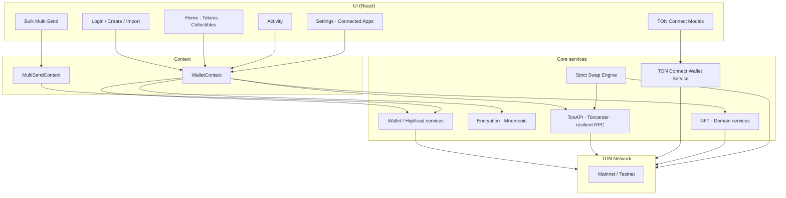
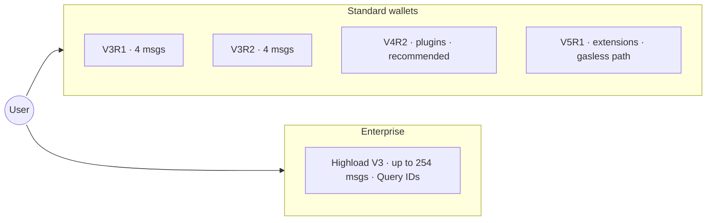
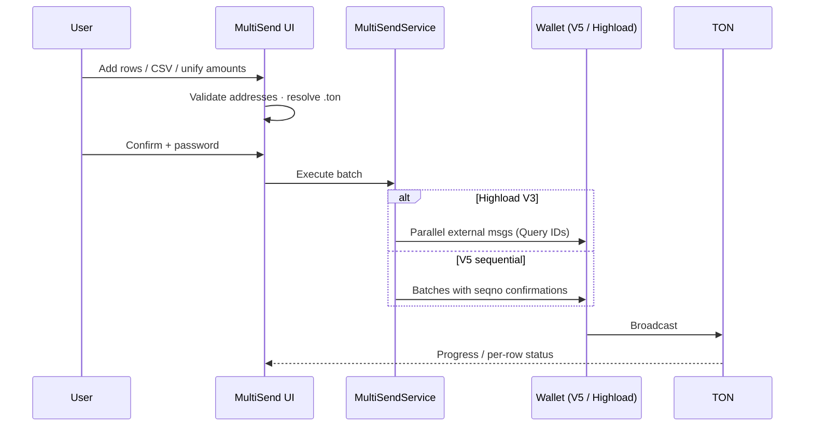
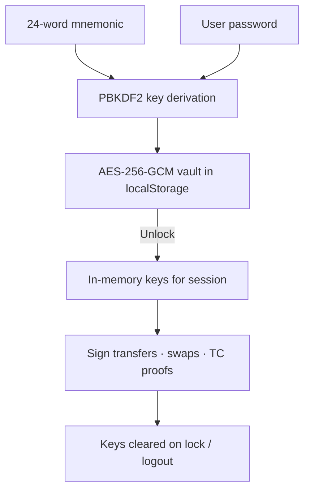

# TON Universal Wallet

A **self-custodial, fully client-side** wallet for [The Open Network (TON)](https://ton.org) — create or import accounts, send TON & jettons, swap on STON.fi / DeDust, manage NFTs & `.ton` domains, connect dApps via TON Connect, and run **enterprise batch payouts** with **Highload V3**.

Built with **TypeScript**, **React 19**, **Vite**, **Tailwind CSS**, and the official **`@ton/core` / `@ton/ton` / `@ton/crypto`** stack. No backend required: keys never leave the browser.

<p align="center">
  <a href="https://github.com/mohamedx500/ton-wallet-webapp"></a>
  <a href="#tech-stack"></a>
  <a href="#tech-stack"></a>
  <a href="#tech-stack"></a>
  <a href="https://ton.org"></a>
  <a href="https://t.me/openreason"></a>
</p>

---

## Quick start

### 1. Clone

```bash
git clone https://github.com/mohamedx500/ton-wallet-webapp.git
cd ton-wallet-webapp
```

### 2. Install dependencies

Requires **Node.js 18+** (20+ recommended).

```bash
npm install
```

### 3. Configure environment

```bash
cp .env.example .env
```

Edit `.env`:

```env
# Required for strict swap / wallet composition
VITE_TON_NETWORK=mainnet

# Optional RPC timeout (ms)
VITE_TON_RPC_TIMEOUT_MS=30000

# TonAPI — https://tonconsole.com
VITE_TONAPI_KEY=

# Toncenter — https://toncenter.com or @tonapibot
VITE_TONCENTER_API_KEY=
```

<details>
<summary><strong>How to get API keys</strong></summary>

**TonAPI**

1. Open [tonconsole.com](https://tonconsole.com)
2. Create an account → generate an API key
3. Set `VITE_TONAPI_KEY`

**Toncenter**

1. Open Telegram → [@tonapibot](https://t.me/tonapibot)
2. `/start` → request a key
3. Set `VITE_TONCENTER_API_KEY`

Optional failover keys (commented in `.env.example`):

- `VITE_TONAPI_KEY_2`
- `VITE_TONCENTER_API_KEY_2`

</details>

> Keys stay in the Vite client bundle. Use **restricted / rate-limited** keys for public deployments.

### 4. Run

```bash
npm run dev
```

Open the URL Vite prints (typically `http://localhost:5173`).

### 5. Production build

```bash
npm run build
npm run preview
```

### Useful scripts

| Command | Description |
| --- | --- |
| `npm run dev` | Dev server |
| `npm run build` | Typecheck + production bundle |
| `npm test` | Vitest (full suite) |
| `npm run type-check` | `tsc --noEmit` |
| `npm run type-check:strict` | Stricter TS project |

---

## Highlights

| | |
| --- | --- |
| **Highload V3** | Up to **254 messages** per external message — parallel Query-ID bursts for mass payouts |
| **Multi-wallet** | V3R1 · V3R2 · V4R2 · V5R1 · Highload V3 in one UI |
| **Bulk / Multi-Send** | CSV import, `.ton` DNS, Jetton + TON rows, live batch progress |
| **DEX swaps** | Strict STON.fi path with destination verification & recovery |
| **TON Connect** | Connect Fragment & other dApps; sessions, `ton_proof`, Connected Apps |
| **Collectibles** | NFTs, domains, transfer, Getgems / explorer links |
| **Security** | AES-256-GCM + PBKDF2 mnemonic vault — password unlock only |

---

## Tech stack

| Layer | Technologies |
| --- | --- |
| UI | React 19, Framer Motion, Lucide, Tailwind CSS, Radix primitives |
| App | Vite 5, TypeScript 5.3 |
| Chain | `@ton/core`, `@ton/ton`, `@ton/crypto`, `@tonconnect/protocol` |
| DEX | `@ston-fi/sdk`, `@ston-fi/api` |
| Data | TonAPI, Toncenter |
| Tests | Vitest |

---

## Architecture

> **Note:** Mermaid diagrams render on **GitHub**. Cursor / VS Code’s built-in Markdown preview often shows the source as a plain code block — that does not mean the chart is wrong.



### Design principles

- **Client-only custody** — seed phrases encrypted locally; unlock with password
- **Versioned wallet adapters** — same UI flows across V3–V5 and Highload
- **Strict swap composition** — quotes and destinations verified before sign/send
- **Resilient networking** — timeouts, failover keys, connection quality awareness

---

## Project structure

```text
ton-wallet-webapp/
├── src/
│   ├── components/          # Screens, modals, MultiSend, NFT UI
│   ├── context/             # WalletContext, MultiSendContext
│   ├── wallets/             # v3r1 · v3r2 · v4r2 · v5r1 · highload-v3
│   ├── wallet/              # Descriptors, signers, highload helpers
│   ├── tonconnect/          # TON Connect wallet-side protocol
│   ├── swap/                # Strict DEX engine (STON.fi)
│   ├── nft/                 # Collectibles + .ton DomainService
│   ├── tokens/              # Display filtering / naming
│   ├── transfer/            # Native + jetton builders
│   ├── crypto/              # Encryption, mnemonic, offline signing
│   ├── network/             # TonAPI client, resilient RPC
│   ├── services/            # WalletCore, MultiSend, discovery, …
│   ├── config/              # Fees, known tokens, app wiring
│   ├── App.tsx              # Shell + navigation
│   └── main.tsx             # Providers bootstrap
├── tests/                   # Vitest suites
├── scripts/                 # Utility scripts
├── .env.example
├── DOCUMENTATION.md         # Extended internal docs
└── package.json
```

---

## Wallet versions



| Version | Max msgs / tx | Strength | Typical use |
| --- | --- | --- | --- |
| V3R1 | 4 | Simple | Basic transfers |
| V3R2 | 4 | Gas efficiency | Everyday sends |
| **V4R2** | 4 | Plugins | **Default choice** |
| V5R1 | 4* | Extensions / gasless path | Advanced / sponsored flows |
| **Highload V3** | **254** | Parallel Query-ID bursts | **Mass payouts / Bulk** |

\* Effective batching for multi-send may use sequential W5 batches when Highload is not selected.

---

## Feature deep dive

### Home — Tokens & Collectibles

- **Tokens** — filtered jetton list (zero / dust / blacklist / dedupe by master address), ticker-first names, unit price + 24h change, hold balance, mini sparkline
- **Collectibles** — NFT grid/list, detail sheet, transfer, Getgems / Tonviewer links, `.ton` domain enrichment

### Bulk (Multi-Send)



- Per-row coin picker (TON + discovered jettons)
- Comment / amount unification
- Pre-flight balance awareness and on-chain confirmation tracking

### DEX swaps

- Strict application layer around STON.fi quoting & execution
- Destination / trust checks before signing
- Recovery bootstrap for interrupted swap flows

### TON Connect

- Connect / disconnect sessions (e.g. Fragment)
- `ton_addr` + device info + real `ton_proof` after password unlock
- **Settings → Connected Apps** to list and revoke sessions
- Highload-compatible connect payloads when that wallet type is active

### Security model



- Seed never sent to a server
- Sensitive actions re-prompt for password where required
- Prefer hardware / cold workflows for large treasuries; this app is a hot wallet UI

---

## UI map

| Surface | Role |
| --- | --- |
| `LoginScreen` | Create / import / unlock |
| `HomeTab` | Actions, Tokens ↔ Collectibles |
| `ActivityTab` | Transaction history |
| `BottomNavigation` | Wallet · Activity · **Bulk** · Settings |
| `MultiSend/*` | Batch composer + progress |
| `NftTab` / `NftDetailModal` | Collectibles & domains |
| `TonConnect*Modal` | Connect & transaction requests |
| `ConnectedAppsModal` | Session management |
| `WalletModals` | Send, receive, swap, token detail, backup |

---

## Networks & APIs

| Service | Purpose |
| --- | --- |
| TonAPI | Balances, jettons, NFTs, rates, events |
| Toncenter | RPC broadcast / account state (strict paths) |
| STON.fi | Swap quotes & routes |
| Getgems / Tonviewer | External NFT / explorer links |

Switch **Mainnet ↔ Testnet** in Settings. Testnet often lacks USD pricing; positive balances still display.

---

## Testing

```bash
npm test
npm run type-check
npm run type-check:strict
npm run build
```

Coverage spans wallet descriptors, Highload helpers, transfer builders, swap validation, TON Connect payloads, NFT URL helpers, and token display filtering.

---

## Security notes

- Never commit `.env` or seed phrases
- Treat browser storage as **hot** — use dedicated accounts for large funds
- Review Connected Apps regularly; disconnect unused dApps
- API keys in `VITE_*` are visible to clients — rate-limit them

---

## Roadmap ideas

- Deeper DeDust aggregation in the strict swap path
- Richer historical sparklines from rates APIs
- Hardware-wallet / extension packaging
- Optional IndexedDB vault backends

*(Contributions welcome — open an issue or PR.)*

---

## Documentation

- [`.env.example`](./.env.example) — environment template  
- [`DOCUMENTATION.md`](./DOCUMENTATION.md) — long-form internal documentation  

---

## Developer

Questions, bugs, or collaboration:

**Telegram:** [@openreason](https://t.me/openreason)

---

## License

Distributed for use with this repository. See project files and commit history for licensing intent; add a `LICENSE` file if you publish a formal SPDX license.

---

<p align="center">
  <sub>Built for TON · Highload-ready · Self-custodial</sub><br/>
  <a href="https://t.me/openreason">@openreason</a>
</p>
